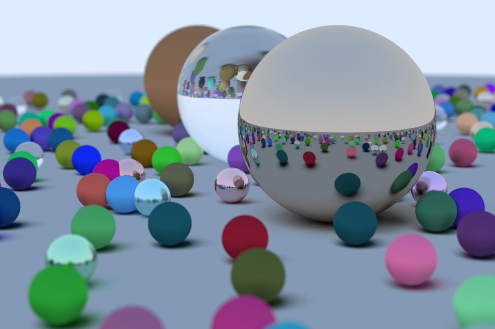

# Raytracer

This is an implementation of the Raytracer from [Raytracing in One Weekend](https://raytracing.github.io/books/RayTracingInOneWeekend.html). It is written in Rust instead of the original C++.
I used this as an opportunity to write a non-trivial amount of Rust code and consider some ways it differs from C++ (though I'm not at all experienced in C++).

I learned late into the project that Daniel Busch has [translated the book into Rust](https://misterdanb.github.io/raytracinginrust/). While I enjoyed my process of reading C++ and translating, which forced me to type out the Rust code and consider Rust patterns, I certainly found it useful to consult this implementation afterwards and see how it improved on my first pass. It also clearly shows how to add [parallelism](https://misterdanb.github.io/raytracinginrust/#wherenext?/parallelism), which is one of the suggested improvements in the original book.

## Usage

Run `./generate.sh` to output a single ray-traced image.

With the default settings, this take ~90 seconds on a 2021 MacBook Pro with 16GB of RAM.

## Example output

